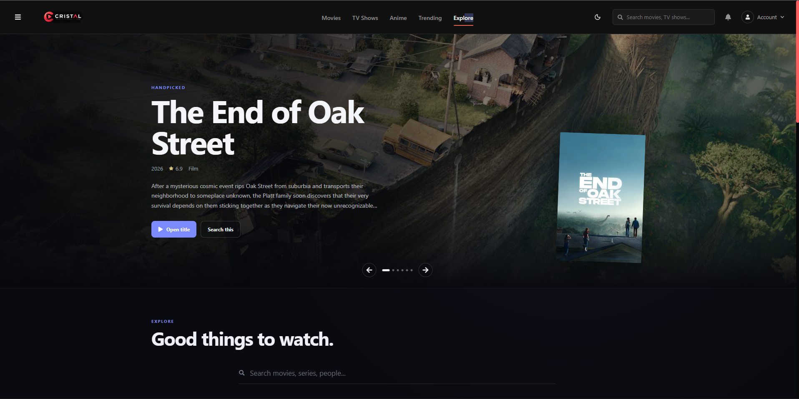
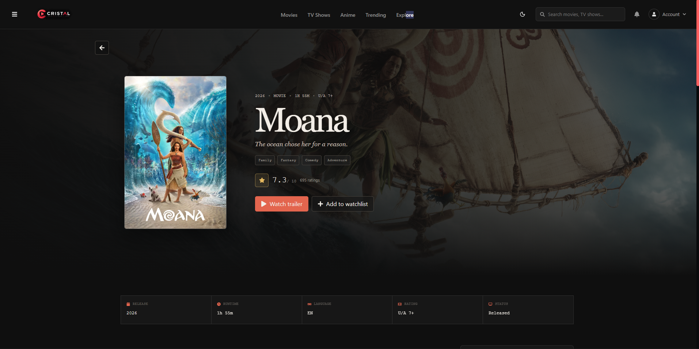
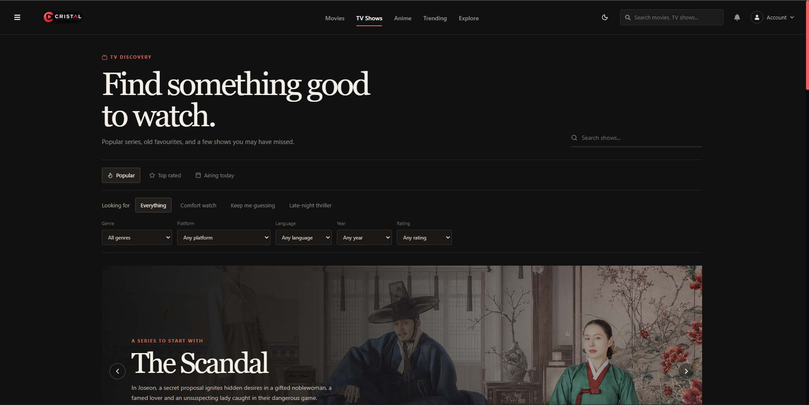
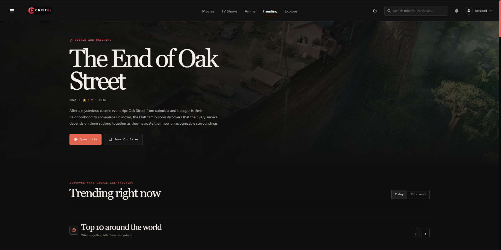
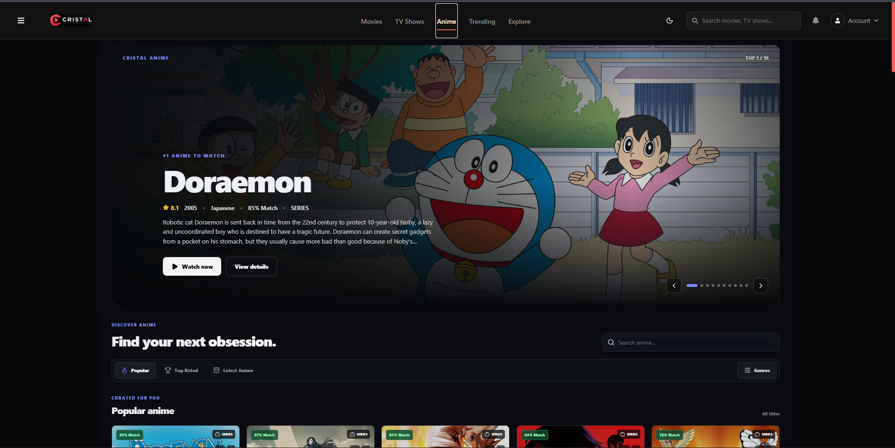

# CRISTAL

### A modern movie & TV discovery platform built with React

CRISTAL is a modern entertainment discovery platform designed to make finding movies and TV shows simple, visual, and enjoyable.

It uses the TMDB API to provide movie and TV information, search, ratings, genres, trending content, detailed pages, and a personal library — all inside a responsive, dark-themed interface.

**Live Demo:** https://cristal-movie-discovery-ewml.vercel.app/
**Repository:** https://github.com/0vansh0/cristal-movie-discovery

---

## Overview

CRISTAL started as a frontend project and gradually evolved into a complete entertainment discovery experience.

The goal was not only to display movie data, but to build an interface that feels like a real streaming and discovery product — combining content discovery, personalization, interactive UI, animations, and AI-powered features.

### What you can do with CRISTAL

* Discover movies and TV shows
* Explore trending and popular content
* Browse dedicated movie and TV sections
* Explore anime content
* Search for movies and shows
* View detailed information about titles
* Get personalized suggestions with CRISTAL AI
* Discover random titles with Surprise Me
* Explore genres, ratings, and release information
* Save titles to a personal library
* Enjoy a responsive experience across devices
* Get live movie and TV data through the TMDB API

---

## Screenshots

### Home



### Movie Details



### TV Shows



### Trending



### Anime



---

# Features

## 🎬 Movie Discovery

Explore a large collection of movies with information such as:

* Movie posters and backdrops
* Ratings
* Genres
* Release dates
* Descriptions
* Popularity
* Trending titles
* Detailed movie pages

---

## 📺 TV Shows

Discover TV shows and series through a dedicated browsing experience.

Users can explore:

* Popular TV shows
* Trending series
* Genres
* Ratings
* Release information
* Show details
* Individual seasons and episodes where available

---

## 🤖 CRISTAL AI

CRISTAL includes an AI-powered discovery experience designed to help users find content based on what they are interested in.

Instead of manually browsing through hundreds of titles, users can interact with **CRISTAL AI** to get movie and entertainment suggestions.

The goal of this feature is to make content discovery feel more personal and interactive.

---

## 🎲 Surprise Me

Not sure what to watch?

The **Surprise Me** feature provides a quick way to discover something unexpected.

Instead of searching for a specific movie, users can let CRISTAL choose a title and explore something new.

---

## 🔥 Trending

A dedicated trending section helps users discover content that is currently getting attention.

Users can explore trending:

* Movies
* TV shows
* Popular titles

---

## 🔎 Search

Search across the movie and TV catalog to quickly find specific titles.

The search experience is designed to provide fast access to:

* Movies
* TV shows
* Titles
* Related content

---

## 🎭 Genres & Categories

Explore content through different genres and categories.

Users can discover movies and shows based on interests such as:

* Action
* Adventure
* Comedy
* Drama
* Horror
* Romance
* Sci-Fi
* Thriller
* Animation
* And more

---

## 📖 Detailed Information

Each title has its own detailed view containing relevant information such as:

* Poster
* Backdrop
* Overview
* Rating
* Genres
* Release information
* Popularity
* Related information

This allows users to understand a title before deciding what to watch.

---

## ❤️ Personal Library

Users can save titles they are interested in and access them later from their personal library.

The library provides a convenient way to keep track of interesting movies and shows without searching for them again.

---

## 🧭 Multiple Discovery Sections

CRISTAL provides different ways to explore entertainment content:

* Home
* Movies
* TV Shows
* Trending
* Anime
* Genres
* Search
* Surprise Me
* CRISTAL AI
* Library

---

## 🎨 Premium UI & Interactions

The interface focuses on creating a cinematic and modern experience through:

* Dark visual design
* Interactive movie cards
* Smooth transitions
* Hover effects
* Animated elements
* Glass-style UI elements
* Clear visual hierarchy
* Consistent spacing
* Responsive navigation

---

## 📱 Responsive Design

CRISTAL is designed to adapt to different screen sizes:

* Desktop
* Laptop
* Tablet
* Mobile

The layout and components are designed to remain usable across different devices.

---

## ⚡ Loading & Error States

The application handles asynchronous API requests with dedicated:

* Loading states
* Error states
* Empty states
* API failure handling

This helps maintain a smoother experience while content is being loaded.

---

## 🧩 Reusable Components

The project uses reusable React components to keep the application organized and easier to maintain.

Different pages and sections share common UI components instead of duplicating the same code.

---

## 🔌 TMDB API Integration

CRISTAL uses the TMDB API to retrieve movie and TV information.

The API provides data used throughout the application, including:

* Movie information
* TV information
* Posters
* Backdrops
* Genres
* Ratings
* Trending content
* Search results

---

## Tech Stack

| Technology   | Purpose                    |
| ------------ | -------------------------- |
| React        | Frontend UI                |
| JavaScript   | Application logic          |
| CSS          | Styling and animations     |
| Vite         | Development and build tool |
| TMDB API     | Movie and TV data          |
| Git & GitHub | Version control            |
| Vercel       | Deployment                 |

---

## Project Structure

```text
CRISTAL/
│
├── public/
│
├── src/
│   ├── components/
│   │   ├── layout/
│   │   └── ...
│   │
│   ├── pages/
│   ├── hooks/
│   ├── services/
│   ├── assets/
│   ├── App.jsx
│   └── main.jsx
│
├── screenshot/
│   ├── home.png
│   ├── Movie-details.png
│   ├── Tv_show.png
│   ├── Trending.png
│   └── Anime.png
│
├── .env.example
├── package.json
├── vite.config.js
└── README.md
```

---

## Getting Started

### 1. Clone the repository

```bash
git clone https://github.com/0vansh0/cristal-movie-discovery.git
```

### 2. Move into the project

```bash
cd cristal-movie-discovery
```

### 3. Install dependencies

```bash
npm install
```

### 4. Create environment variables

Create a `.env` file in the project root:

```env
VITE_TMDB_API_KEY=your_tmdb_api_key_here
```

You can get a TMDB API key from the official TMDB developer platform.

### 5. Start the development server

```bash
npm run dev
```

The application will be available at the local URL shown by Vite.

---

## Production Build

To create a production build:

```bash
npm run build
```

To preview the production build locally:

```bash
npm run preview
```

---

## Environment Variables

CRISTAL uses the following environment variable:

```env
VITE_TMDB_API_KEY=your_tmdb_api_key_here
```

The actual API key should **never be committed to GitHub**.

The repository should only contain the example value shown above.

---

## Design Approach

One of the main goals of CRISTAL was to move beyond a basic API-based movie website.

I focused on creating a consistent visual experience with:

* Clear content hierarchy
* Strong typography
* Dark cinematic UI
* Reusable components
* Consistent spacing
* Responsive layouts
* Interactive states
* Smooth transitions and animations

The goal was to make the application feel closer to a real entertainment product rather than a simple API demonstration.

---

## What I Learned

While building CRISTAL, I worked with:

* React component architecture
* Application state management
* API integration
* Asynchronous data handling
* Search and filtering
* Responsive CSS
* Reusable UI components
* Loading and error states
* Environment variables
* Git and GitHub workflows
* Production builds
* Vercel deployment
* Debugging production build issues

One particularly useful lesson was understanding that a project can work locally but fail during production builds because deployment environments such as Linux can handle file and folder name casing differently.

---

## Future Improvements

Some improvements I would like to explore next:

* User authentication
* Cloud-synced personal libraries
* Watchlists
* Advanced filtering
* More personalized recommendations
* Improved CRISTAL AI capabilities
* More detailed user statistics
* Improved accessibility
* Better mobile interactions
* Performance optimization

---

## Disclaimer

CRISTAL is an independent personal project created for learning and portfolio purposes.

Movie and TV information is provided through the TMDB API.

CRISTAL is not affiliated with or endorsed by TMDB.

---

## Author

### Vansh Raj

Frontend developer interested in building interactive web experiences and experimenting with modern UI design.

**GitHub:** https://github.com/0vansh0

**Live Demo:** https://cristal-movie-discovery-ewml.vercel.app/

---

## License

This project is intended primarily as a personal learning and portfolio project.

If you use the project or any part of its code, please provide appropriate attribution.
